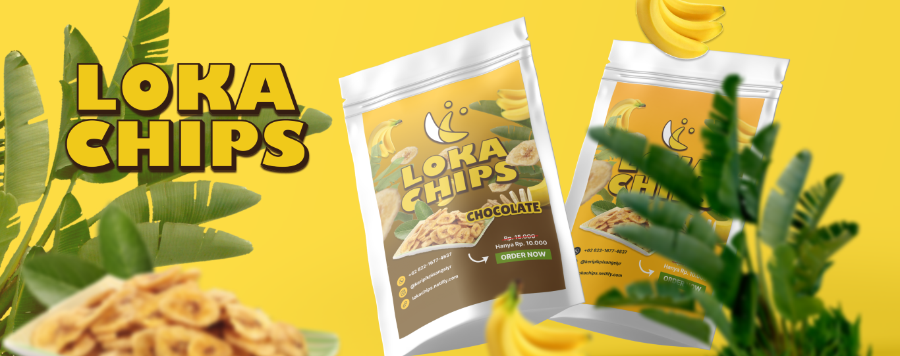

# Loka Chips

This website is an online sales platform for Loka Chips, a distinctive banana chips product from Kep. Selayar, managed by a local micro, small, and medium enterprise (MSME) in Gowa, Indonesia.

Visit Site: [lokachips.netlify.app](https://lokachips.netlify.app)

## Features

Not as complex as others. This website simply provides information about Loka Chips products and offers a way for customers to purchase the products through WhatsApp chat.

The business owner values simplicity and accessibility. The contact form section doesn't rely on a database but is connected to Google Sheets instead. This way, the business owner can easily manage the inquiries there.

## Tech Stack

The technologies used here include [React JS](https://react.dev/) as the main framework, [Tailwind](https://tailwindcss.com/) for styling, and [GSAP](https://gsap.com) for animations. ["Click to chat"](https://faq.whatsapp.com/5913398998672934) is employed for WhatsApp redirection, and [Google Apps](https://www.google.com/script/start/) Script is integrated for form submission and Google Sheets interaction.
